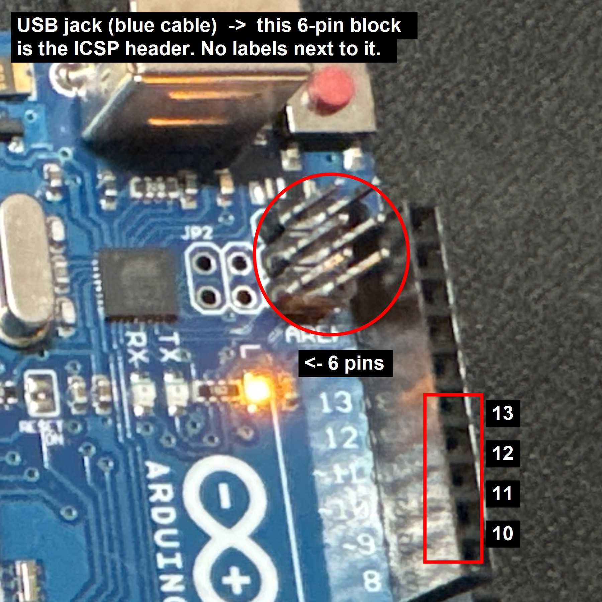
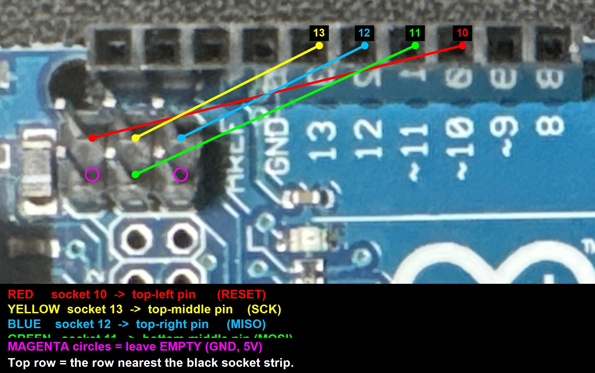

# Uno KVM

Turn any laptop into a **KVM console** for a headless PC or server, using an Arduino Uno R3
and a cheap HDMI capture stick. The laptop shows the target's screen and its keyboard and
trackpad act as a real USB keyboard and mouse on the target — including **BIOS/UEFI, GRUB,
OS installers and rescue shells**, with no network and no software on the target.

```
 LAPTOP (console)                                   TARGET (headless PC / server)
 ┌──────────────────────┐                           ┌──────────────────────────┐
 │ kvm_console.py       │   USB   ┌─────────────┐   │                          │
 │  video window  ◀─────┼─────────┤ HDMI capture│◀──┤ HDMI out                 │
 │                      │         └─────────────┘   │                          │
 │  keyboard+mouse ─────┼──USB──▶ CH340 USB-TTL     │                          │
 │                      │           │ TXD/RXD/GND   │                          │
 └──────────────────────┘           ▼               │                          │
                              Arduino Uno R3        │                          │
                              328P: byte bridge ──▶ 16U2: USB keyboard+mouse ─▶│ USB port
                              (kvm_bridge_328p)     (kvm_hid_16u2)             └──────────────────────────┘
```

Two independent one-way paths: HDMI → laptop screen, laptop input → target USB. The target
only ever sees a normal USB keyboard and mouse, which is why BIOS works.

Built and verified 2026-09 on a Windows 11 laptop against both a Windows PC and a headless
Debian server: 1080p at 30 fps, keyboard and mouse working at the Linux console.

## Parts (about 15 € total besides the Arduino)

| Part | Notes |
|---|---|
| **Arduino Uno R3 with an ATmega16U2 USB chip** | The small square chip next to the USB-B jack, with its own 2x3 pin header beside it. **Clones with a CH340 USB chip cannot do this** — that chip is a fixed serial converter and can't become a keyboard. Windows check: the board shows as `Arduino Uno (COMx)`, USB vendor id `2341`. |
| **CH340G USB-to-TTL adapter** | Any 5 V-tolerant module with TXD/RXD/GND pins. If it has a 3.3 V / 5 V jumper, leave it. |
| **HDMI-to-USB capture stick** | The common MacroSilicon MS2109 sticks (sold as "4K USB 3.0 1080p capture card"; they are USB 2.0 inside) work fine. |
| Jumper wires | 3 for the permanent link, 4 (female-to-male) for the one-time flashing step. |
| 100 nF capacitor | One-time flashing step only. |
| Cables | USB-B for the Uno (to the **target**), USB for the CH340 and the stick (to the **laptop**), HDMI from the target to the stick. |

## Repository layout

```
firmware/kvm_hid_16u2/       16U2 firmware: boot-protocol USB keyboard + mouse (HoodLoader2 + HID-Project)
firmware/kvm_bridge_328p/    328P firmware: relays bytes between the CH340 (D2/D3) and the 16U2
console/kvm_console.py       laptop app: capture window + input forwarding (pygame, OpenCV, pyserial)
console/build-windows.ps1    builds a single-file UnoKVM.exe (PyInstaller)
console/install-console-laptop.sh   turns a bare Debian laptop into a boot-to-console appliance
flash.ps1                    arduino-cli wrapper for the three flashing steps
test-link.ps1                wiring test from any Windows PC, no Python needed
docs/                        photos of the wiring
```

## 1. Wiring

### Permanent: CH340 adapter ↔ Uno

| CH340 pin | Uno socket | |
|---|---|---|
| **GND** | **GND** | shared ground, required |
| **TXD** | **D2** | laptop → Arduino |
| **RXD** | **D3** | Arduino → laptop (ping replies, keyboard LED state) |
| VCC / 5V / 3V3 | **not connected** | the Uno is powered by the target's USB, the adapter by the laptop's USB. Never tie the two 5 V rails together. |

TXD goes to the *receiving* pin: adapter **TXD → D2**, adapter **RXD → D3**. If nothing works,
this swap is the first thing to check. D0/D1 are deliberately not used: on the Uno they are
already wired to the 16U2, so the adapter gets its own pins.

Diagnostics built into the hardware: the Uno's **L LED** (D13) flickers whenever bytes pass
through the bridge; the 16U2's **RX LED** flickers on every valid frame. Two glances tell you
which half of the link is broken.

### One-time: flashing the 16U2 (4 wires + capacitor, removed afterwards)

The Uno's 328P flashes the HoodLoader2 bootloader into the 16U2 through the 16U2's ICSP
header. That is the **unlabelled 2x3 pin block right beside the USB-B jack** — not the one near
the big 328P chip (wiring the wrong header makes pin 10 reset the 328P itself, and the install
sketch restarts forever).



Hold the board with the USB jack on the left and the digital sockets along the top. "Top row"
is the row of the block nearest the sockets.

| From socket | To pin of the 2x3 block |
|---|---|
| **10** | top row, **left** (RESET) |
| **13** | top row, **middle** (SCK) |
| **12** | top row, **right** (MISO) |
| **11** | bottom row, **middle** (MOSI) |
| **100 nF capacitor** | between **RESET** and **GND** on the POWER header |

Bottom-left (GND) and bottom-right (5V) of the block stay empty. The capacitor is required:
without it the target's auto-reset circuit restarts the 328P the moment it pulls the 16U2
into reset, and the burn never completes.



## 2. Flashing (Windows, Uno plugged into the flashing PC)

Requires [arduino-cli](https://arduino.github.io/arduino-cli/) (`winget install ArduinoSA.CLI`).
`flash.ps1` wraps the rest; run `.\flash.ps1 ports` whenever unsure which COM port the board is on
(it changes between steps as the board re-enumerates).

```powershell
.\flash.ps1 setup                 # once: HoodLoader2 board package + HID-Project library
.\flash.ps1 install -Port COM4    # 1. installation sketch onto the 328P (stock "Arduino Uno" port)
#    unplug, wire the 4 jumpers + capacitor, replug. L LED: slow blink ~10 s, burn ~30 s,
#    FAST flicker = success. Unplug, remove wires + capacitor, replug.
.\flash.ps1 bridge  -Port COMx    # 2. 328P bridge   (board now shows as "HoodLoader2 Uno")
.\flash.ps1 hid     -Port COMx    # 3. 16U2 keyboard+mouse firmware
```

After step 3, Device Manager shows an *HID Keyboard Device* and an *HID-compliant mouse* and
**no COM port**. The HID build deliberately drops the USB serial interface (`-DCDC_DISABLED`):
the 16U2 has only four USB endpoints, a serial interface takes three, and with it only one HID
device fits (you get a mouse but no keyboard).

If the install-sketch burn keeps failing, the sketch prints why at 115200 baud on the stock
serial port ("Failed to enter programming mode" = a wire; the welcome banner repeating right
after "Attempting to enter programming mode" = missing capacitor or wrong header).

**Re-flashing later**: with no serial interface, arduino-cli can't auto-reset the 16U2. Put it
into the bootloader first, then run `bridge`/`hid` against the `HoodLoader2 Uno` port that
appears: either `.\test-link.ps1 -Bootloader` (CH340 plugged into the flashing PC — the
firmware reboots the 16U2 into HoodLoader2 on command) or short the 16U2's RESET pin (top-left
of the block) to the GND pin below it **twice** quickly.

Toolchain note: HoodLoader2 2.0.5 pins avr-gcc 4.8, which can't build the current Arduino core;
`flash.ps1` points the build at the avr-gcc 7.3 that the stock Uno core installs.

### Wiring test without a laptop

Plug the CH340 into the flashing PC, the Uno into any target (the same PC is fine):

```powershell
.\test-link.ps1                    # pings the 16U2 through the whole chain, reports the target's Num/Caps state
.\test-link.ps1 -Move              # + moves the target's mouse in a square
.\test-link.ps1 -Type "hello kvm"  # + types into whatever has focus on the target after 5 s
```

## 3. The console app

`console/kvm_console.py` shows the capture stick's picture in a window and forwards the
keyboard and mouse.

| Key | Effect |
|---|---|
| **Pause**, Enter or a click (while released) | capture keyboard + mouse — everything now goes to the target |
| **Pause** (while capturing) | release; also happens automatically on focus loss, with a release-all so no key can stay stuck |
| **F** / **Q** (while released) | fullscreen / quit |

Status line: `HID ok` means the 16U2 answered a ping within 2.5 s; it also mirrors the target's
Num/Caps/Scroll state. Keys are sent as physical positions (HID usage codes), so the *target's*
keyboard layout decides what a key types, exactly like a real keyboard plugged into it.

```
--serial COMx | /dev/ttyUSB0   CH340 port (auto-detected by USB id if omitted)
--video auto | 1 | /dev/video2 capture device (auto: first device that delivers a 1080p frame)
--fullscreen --no-video --list --probe --bootloader
```

### Windows laptop

Either `pip install -r console/requirements.txt` and run the script, or build the single-file
exe once on any Windows machine with Python 3.12:

```powershell
pip install -r console\requirements.txt pyinstaller
.\console\build-windows.ps1        # -> console\dist\UnoKVM.exe
```

Copy `UnoKVM.exe` to the laptop, plug in the CH340 and the stick, double-click. SmartScreen
will warn about an unknown publisher (More info → Run anyway). It writes `kvm_console.log`
next to itself.

### Linux laptop

```sh
sudo apt install python3-pygame python3-opencv python3-serial
sudo usermod -aG dialout,video $USER      # re-login afterwards
python3 console/kvm_console.py --fullscreen
```

### Bare laptop → boot-to-console appliance

Install Debian from the netinst image with **no desktop** (standard system utilities only), then:

```sh
sudo bash console/install-console-laptop.sh
sudo reboot
```

The laptop then boots straight into the console, fullscreen, no login (tty1 auto-logs a `kvm`
user that starts a bare X server running the app). Q restarts the console, Ctrl+Alt+F2 is a
normal shell, and there is no GRUB menu wait or kernel log wall on the way in.

Closing the lid suspends the machine, and opening it resumes straight back into the console,
which re-acquires the capture stick by itself. This box is a console rather than a server, so
it is meant to be shut or powered off when unused. If suspend and resume turn out to be
unreliable on your hardware, set `LID_ACTION=poweroff` near the top of the install script.

## 4. Things that bit us (read before debugging)

- **Capture stick = USB 2.0 whatever the box says.** The MS2109 (USB id 345F:2109) does 1080p at
  30 fps only as MJPG. On Windows the DirectShow backend silently ignores the MJPG request and
  streams raw YUY2 at 10 fps; the Media Foundation backend delivers MJPG at 30 fps — but takes
  ~30 s to open unless `OPENCV_VIDEOIO_MSMF_ENABLE_HW_TRANSFORMS=0`. The app does all of this;
  `--probe` measures every backend/format/size combination if your stick behaves differently.
- **Windows Update's OpenSSH / driver downloads may hang.** Nothing to do with this project, but
  if your laptop lacks the CH340 driver, get `CH341SER.EXE` from WCH or export the driver from a
  machine that has it (`C:\Windows\System32\DriverStore\FileRepository\ch341ser*`).
- **Antivirus webcam protection** (Kaspersky and friends) prompts for every new build of the exe
  and blocks frames until you answer. Tick "remember" when allowing.
- **Multi-monitor test targets**: Win+P "Duplicate" gave the stick a black signal; "Extend"
  works. Irrelevant on a real headless target where the stick is the only display.
- **Ctrl+Alt+Del on a Linux text console reboots the machine.** Don't send it by accident.
- Mouse is relative only (fine for BIOS and installers). No power button: a relay on the
  target's front-panel header driven by one more frame type is the obvious next step.

## Wire protocol (laptop → 16U2)

One frame per command: `0xA5  type  len  payload…  xor(type, len, payload…)`

| type | payload | meaning |
|---|---|---|
| `0x01` / `0x02` | usage code | key press / release (HID usage page 7; `0xE0`–`0xE7` = modifiers) |
| `0x03` | – | release all keys |
| `0x10` | dx, dy, wheel (int8) | mouse move |
| `0x11` | mask | mouse buttons, absolute (bit0 left, bit1 right, bit2 middle) |
| `0x1F` | – | release everything |
| `0x20` | – | ping → reply `0xA5 0xA0 0x01 <leds> xor` (bit0 Num, bit1 Caps, bit2 Scroll) |
| `0x7E` | `"BL"` | reboot the 16U2 into the HoodLoader2 bootloader |

Link: 38400 baud 8N1 through the 328P bridge. If no valid frame arrives for 2.5 s while anything
is held, the firmware releases everything.

## Credits

Built on [HoodLoader2](https://github.com/NicoHood/HoodLoader2) and
[HID-Project](https://github.com/NicoHood/HID) by NicoHood. MIT licensed.
